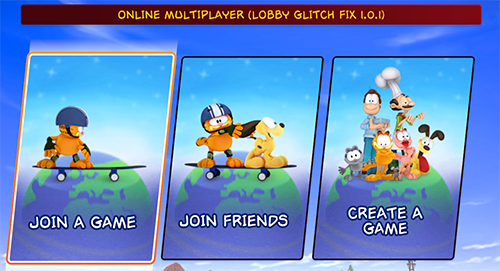

# Garfield Kart Furious Racing Lobby Glitch Fix

This mod fixes the _lobby glitch_ bug in Garfield Kart Furious Racing multiplayer games.

## Installation

**Only the multiplayer host needs to install the mod.**

1. Install BepInEx into the Garfield Kart game root folder
    * Grab latest 5.x release from https://github.com/BepInEx/BepInEx/releases
    * More info: https://docs.bepinex.dev/articles/user_guide/installation/index.html
2. Download the latest `GKFRLobbyGlitchFix.dll` from the [releases](https://github.com/mentalvary/GKFRLobbyGlitchFix/releases) page.
3. Copy it into `<game root folder>/BepInEx/plugins/`
4. If you did everything right, you will see "lobby glitch fix" in the Online Multiplayer menu title:

    

Example file structure:

```
C:\Program Files (x86)\Steam\steamapps\common\Garfield Kart - Furious Racing
├───BepInEx
│   ├───cache
│   ├───config
│   ├───core
│   ├───patchers
│   └───plugins
|       └───GKFRLobbyGlitchFix.dll
├───Garfield Kart Furious Racing_Data
└───MonoBleedingEdge
```

## Background

### What's the lobby glitch?

What some circles call the "lobby glitch" happens semi-rarely in multiplayer games. When it happens, you get stuck on the race results screen instead of going to the next track after the countdown. You can't exit the game normally, but have to force quit and restart the game.

### Why does it happen?

Garfield Kart has special timers that take care of countdowns, such as:

* `END_OF_RACE`: 20s countdown after the first player finishes, after which the race ends for everyone and the results screen shows.
* `RESULTS`: 10s countdown on the results screen, after which the game goes to the next track (or the podium scene).

Side note: the countdown **display** only activates when there are 15s left, so the 20s `END_OF_RACE` countdown doesn't show for the first 5s.

**The game can only have one such timer active**. The game ignores new timers if one is already active.

The lobby glitch happens due to a race condition (pun intended):

* Whenever a player finishes, the `END_OF_RACE` timer is triggered again. Not just for 1st place. Usually, it doesn't actually start, because the `END_OF_RACE` timer from 1st place is already active.
* After the `END_OF_RACE` timer finishes, it moves to the results screen, which triggers the `RESULTS` timer on entering.
* If a player finishes **exactly** when the `END_OF_RACE` timer finishes, but before the `RESULTS` timer is started, it will trigger another `END_OF_RACE` timer (which now starts since no other timer is active).
* This second `END_OF_RACE` timer now blocks the `RESULTS` timer from starting, so the results screen never ends. When the second `END_OF_RACE` timer finishes, it does not trigger the `RESULTS` timer again, because the game is already in the results menu.

You can observe this behavior in the game: the countdown on the results screen starts at 15s instead of 10s (because it's actually the 20s `END_OF_RACE` countdown again, with the display kicking in at 15s).

The race condition risk increases if there are players with slow connections. The game waits for a synchronization point (all players received results from master client) before it shows the results. This makes it much more likely for another player to cross the finish line inbetween the two timers.

<details>
<summary>Log sequence when the glitch doesn't happen</summary>

| Log event | Comment |
|-------|---------|
| `InGameGameMode.OnLocalHumanDriverRaceEnded` | 1st place crosses finish line |
|`StartTimer(END_OF_RACE) - active timer: NONE` | `END_OF_RACE` timer starts. No other timer is active. |
|`Active timer now: END_OF_RACE` | Game has accepted `END_OF_RACE` timer|
| `InGameGameMode.OnLocalHumanDriverRaceEnded` | Another player crosses finish line (before the countdown is done) |
| `StartTimer(END_OF_RACE) - active timer: END_OF_RACE, time left: 3.1504045s` | Another `END_OF_RACE` timer starts, but the first one is still active for 3s.
|`Active timer now: END_OF_RACE` | Game is still running the original `END_OF_RACE` timer|
|`Timer END_OF_RACE done.`| Original `END_OF_RACE` timer ends.|
| `MenuHDResultsLeaderboard.Enter` | Results menu shows |
| `StartTimer(RESULTS) - active timer: NONE` | `RESULTS` timer starts. No other timer is active. |
| `Active timer now: RESULTS` | Game has accepted `RESULTS` timer |
|`Timer RESULTS done.` | `RESULTS` timer ends. Game proceeds to next track |

</details>

<details>
<summary>Log sequence when the glitch happens</summary>

| Log event | Comment |
|-------|---------|
| `InGameGameMode.OnLocalHumanDriverRaceEnded` | 1st place crosses finish line |
|`StartTimer(END_OF_RACE) - active timer: NONE` | `END_OF_RACE` timer starts. No other timer is active. |
|`Active timer now: END_OF_RACE` | Game has accepted `END_OF_RACE` timer|
|`Timer END_OF_RACE done.`| `END_OF_RACE` timer ends.|
|`InGameGameMode.OnLocalHumanDriverRaceEnded`| **Another player crosses finish line** |
|`StartTimer(END_OF_RACE) - active timer: NONE`| **`END_OF_RACE` timer starts again, and no other timer is active this time.** |
|`Active timer now: END_OF_RACE` | **Game has accepted second `END_OF_RACE` timer**|
| `MenuHDResultsLeaderboard.Enter` | Results menu shows |
|`StartTimer(RESULTS) - active timer: END_OF_RACE, time left: 19.90011s` |  **`RESULTS` timer starts, but `END_OF_RACE` is active.** |
| `Active timer now: END_OF_RACE` | **Game did not accept `RESULTS` timer, continues with `END_OF_RESULTS`.** |
|`Timer END_OF_RACE done.`| `END_OF_RACE` timer ends. Nothing else happens.|
</details>

### How does this mod fix it?

The mod changes it so the game only accepts **one** `END_OF_RACE` timer per race (from the first player to cross the finish line). Any subsequent calls are ignored. So there is no chance for a second `END_OF_RACE` to block the `RESULTS` timer.

## How to build the mod yourself

If you wish to build the DLL from the source code yourself, instead of trusting the uploaded release, you can do so:

1. Install the latest .NET SDK: https://dotnet.microsoft.com/en-us/download
2. Clone/download this repo
3. From your Garfield Kart game folder, in the `Garfield Kart Furious Racing_Data\Managed` directory, copy the `Assembly-CSharp.dll` and `Unity.TextMeshPro.dll` files to a `lib` folder **next** to the repo folder.
4. In the repo folder, run:

    ```
    dotnet build --configuration release
    ```

5. Find the built `GKFRLobbyGlitchFix.dll` under `bin/release/net46`
